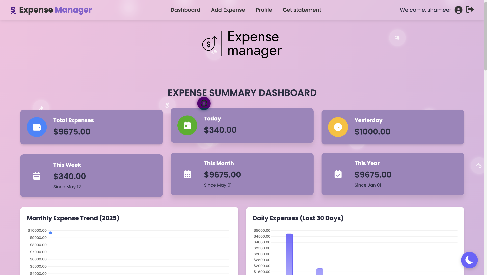
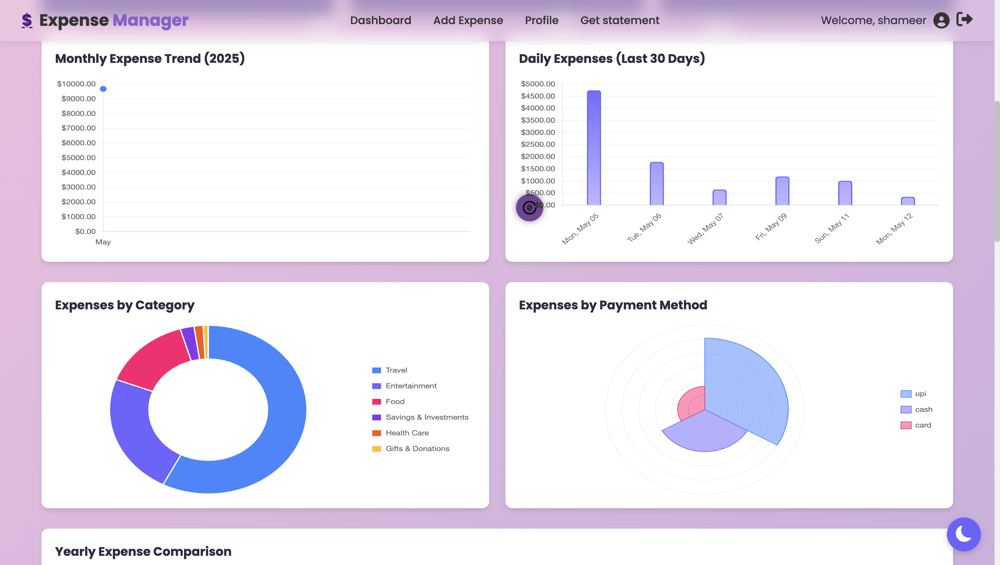
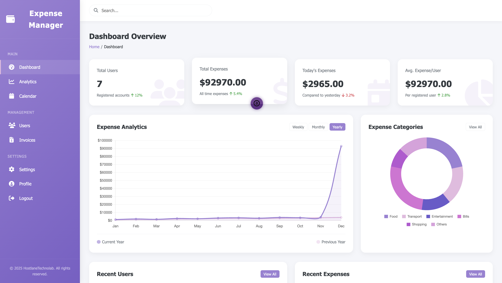

# Expense Manager

A web-based **Expense Manager** built using **Django**. This application allows users to manage their expenses efficiently with features like adding, updating, deleting expenses, and visualizing their expense summaries through dynamic charts and graphs using **Chart.js**.

---

## 🚀 Features

### 🔑 User Authentication
- Secure user registration and login.
- Each user has their own isolated expense data.

### 📝 Expense Management
- **Add Expenses**: Record your daily expenses.
- **Update Expenses**: Modify existing expense records.
- **Delete Expenses**: Remove incorrect or unwanted expense entries.

### 📊 Expense Summary & Visualization
- Dynamic visual summaries of expenses using **Chart.js**:
  - Pie Charts
  - Donut Charts
  - Bar Graphs
- Filter expenses by categories or date ranges for deeper insights.

---

## 🛠️ Technologies Used
- **Backend**: Django
- **Frontend**: HTML, CSS, JavaScript
- **Charts**: Chart.js
- **Database**: SQLite (default Django database)
- **Authentication**: Django's built-in authentication system

---

## 📦 Installation

### Prerequisites
- Python 3.8+ installed on your system
- Virtualenv (optional but recommended)

### Steps
1. Clone the repository:
   ```bash
   git clone https://github.com/rebin03/expense-manager.git
   cd expense-manager
   ```

2. Create a virtual environment and activate it:

    ```bash
    python -m venv env
    source env\Scripts\activate   # On Mac: env/bin/activate 
    ```
3. Install the required dependencies:

    ```bash
    pip install -r requirements.txt
    ```
4. Apply migrations:

    ```bash
    python manage.py makemigrations
    python manage.py migrate
    ```

5. Start the development server:

    ```bash
    python manage.py runserver
    ```
Access the application: Open http://127.0.0.1:8000 in your browser.

## 🖼️ Screenshots
### Register

### Login


### Dashboard


### Add expense


### Expense summary



